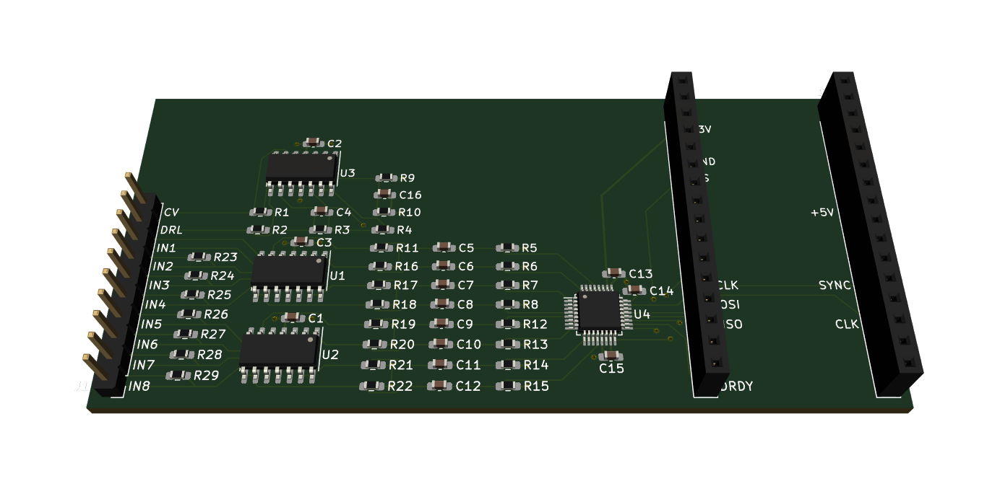

These designs are for a low-cost biosensing board for measuring signals such as EMG, EEG, or ECG.

The board is designed to plug into an Adafruit Feather M4 Express and send the collected signals back to a computer over USB.

**Disclaimer:** Connecting electrical circuitry to your body can be dangerous.  I do not make any guarantees to the safety of this design.  Before building, you should conduct your own analysis of safety.

